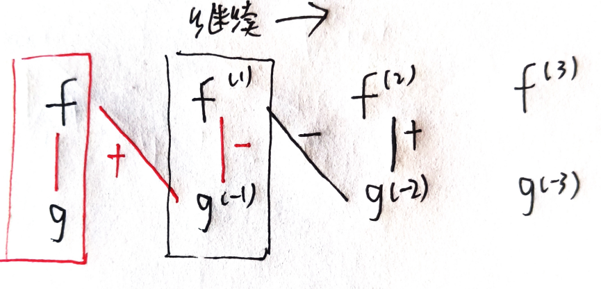

# 第四章 不定积分
[toc]
## 第一节、原函数与不定积分的概念
**原函数与不定积分**：不定积分就是带不同常数项的原函数的集合，两者导数相同，都是被积函数。
**原函数存在定理**：连续函数一定有原函数。

>**说明**：
$
\begin{cases}
\frac{d[\int f(x)dx]}{dx}=f(x)&\rightarrow d[\int f(x)dx]=f(x)fx\\
\int F(x)'dx=F(x)+C&\rightarrow \int dF(x)=F(x)+C
\end{cases}
$
==$\int$和d抵消或差一常数==
---
 **基本积分表**
1. $\int kdx=kx+c (k\ is\ const)$ 
2. $\int x^udx=\frac{x^{u+1}}{u+1}+c(u\ne-1)$
3. $\int \frac{dx}{x}=ln|x|+c$
4. $\int \frac{dx}{1+x^2}=arctanx+c$
5. $\int \frac{dx}{\sqrt{1-x^2}}=arcsinx+c$
6. $\int cosxdx=sinx+c$
7. $\int sinxdx=-cosx+c$
8. $\int \frac{dx}{cosx^2}=\int sec^2xdx=tanx+c$
9. $\int \frac{dx}{sin^2 x}=\int csc^2xdx=-cotx+c$
10. $\int secx\cdot tanxdx=secx+c$
11. $\int cscx\cdot cotxdx=-cscx+c$
12. $\int e^xdx=e^x+c$
13. $a^xdx=\frac{a^x}{lna}+c$

**不定积分性质**：线性（齐次可加性）。
>**证明**：右边导数等于左边的被积函数
## 第二节、换元积分法
### 1.第一类换元法
$$\int f[\phi (x)]\phi '(x)dx=\int f[\phi(x)]d\phi(x)$$
>**说明**：
$\phi'(x)dx=d\phi(x)$即：
$\phi'(x)dx=d\{\int\phi'(x)dx\}$
---
**经验**：
- 形如$\frac{1}{a^2-x^2}$进行列项处理
- 对于含奇数次幂的sinx和cosx相乘，把奇数次幂拆开为1+偶数次，1拿到后面和dx合并并变形，偶数次根据$sin^2x+cos^2x=1$变形。
- 对于只含偶次幂的sinx和cosx相乘，利用二倍角公式进行统一。
- 对于不同角频率的sin(mx)和cos(nx)相乘，利用积化和差公式分离。
- sec(x)和tan(x)关系密切：$\sec^2(x)dx=dtan(x),sec(x)tan(x)dx=dsec(x)$，并且偶数次可相互转换：$\tan^2=sec^2-1$，也就是说sec偶次构造dtan，tan奇次构造dsec。
- --
### 2. 第二类换元法
$$\int f(x)dx=\left[\int f\left[\psi(t)\right]\cdot\psi'(t)dt\right]|_{t=\psi^{-1}(x)}$$
>**证明**：右边对x的导数等于左边关于x的被积函数

**经验**：
- 形如$\sqrt{a^2-x^2}$，利用$1-sin^2=cos^2$消根号
- 形如$\sqrt{x^2+a^2}$，利用$tan^2+1=sec^2$消根号
- 形如$\sqrt{x^2-a^2}$，利用$sec^2-1=tan^2$消根号

---
**常用积分表**
1. $\int \tan x \mathrm{~d} x=-\ln |\cos x|+C$
2. $\int \cot x \mathrm{~d} x=\ln |\sin x|+C$
3. $\int \sec x \mathrm{~d} x=\ln |\sec x+\tan x|+C$ ***由csc得出***
4. $\int \csc x \mathrm{~d} x=\ln |\csc x-\cot x|+C$ ***sin化为二倍角，再变为$tan\cdot cos^2$***
5. $\int \frac{\mathrm{d} x}{a^{2}+x^{2}}=\frac{1}{a} \arctan \frac{x}{a}+C$ ***构造$\frac{1}{1+x^2}$or根据$1+tan^2=sec^2$变形***
6. $\int \frac{\mathrm{d} x}{x^{2}-a^{2}}=\frac{1}{2 a} \ln \left|\frac{x-a}{x+a}\right|+C$ ***裂项***
7. $\int \frac{\mathrm{d} x}{\sqrt{a^{2}-x^{2}}}=\arcsin \frac{x}{a}+C$ ***构造$\frac{1}{\sqrt{1-x^2}}$or根据$1-sin^2=cos^2$消根号***
8. $\int \frac{\mathrm{d} x}{\sqrt{x^{2}+a^{2}}}=\ln \left(x+\sqrt{x^{2}+a^{2}}\right)+C$ ***根据$tan^2+1=sec^2消根号$***
9. $\int \frac{d x}{\sqrt{x^{2}-a^{2}}}=\ln \left|x+\sqrt{x^{2}-a^{2}}\right|+C$ ***根据$sec^2-1=tan^2$消根号***

## 第三节、分部积分法
$$\int udv=uv-\int vdu$$
>**证明**：对乘积的导数两端分别积分处理

**分部积分的结果**：**分部积分法的实质是前导后积**，即u求导，v'积分（注意v'变为dv即完成积分），常见的，幂函数求导降幂，三角$sinx, cosx$求导积分都翻转，$e^x$求导积分都不变
* * *
**经验**：
- 幂函数乘三角：幂导三角积
- 幂乘反三角：反三角导幂积化为分式
- 幂乘对数：对数导幂积化为分式

**补充——表格法**：
对于积分          
$$\begin{aligned}
&\quad\int f \cdot gdx\\
&=\int fdg^{(-1)}\\
&=fg^{(-1)}-\int g^{(-1)}f^{(1)}dx
\end{aligned}$$
图示如下：

**注意**：
- 斜线初始为正，随后正负交替
- 以竖线收尾，竖线符号与上一斜线相反
- 一条斜线和一条竖线表示一次分部积分，斜线为乘积形式，竖线为积分形式
- 斜线正负交替本质是由于竖线正负交替，斜线与前一竖线同号
## 第四节、有理函数的积分
**有理函数**：两个多项式的商即为有理函数（或有理分式），若分子分母无公因式且分子次数小于分母即为真分式，否则为假分式。
**部分分式**：对真分式$\frac {P(x)}{Q(x)}$，若Q(x)可表示为$Q(x)=Q_1(x)\cdot Q_2(x)$，且没有公因式，那么$\frac {P(x)}{Q(x)}$可拆为$\frac {P_1(x)}{Q_1(x)}+\frac {P_2(x)}{Q_2(x)}$两个真分式之和，可用**待定系数法**求解分子。
**有理函数求解经验**：
1. 假分式先用多项式除法化为多项式和真分式之和。
2. 分母若为完全平方，此时分子为1简单，构造$\frac1{\phi(x)}$或者降幂分之一。也可以分母换元处理，转换为$\frac1u$等形式。
3. 若分母非完全平方，先尝试构造三角形式导数，或者分子比分母少一次，尝试能不能用分子直接构造分母的微分。

**可化为有理函数的积分**：

1. sinx和cosx利用二倍角转成tanx（三角通用）
$$\begin{aligned}
& sinx=2sin\frac x2cos\frac x2=\frac{2tan\frac x2}{sec^2{\frac x2}}=\frac{2tan{\frac x2}}{1+tan^2{\frac x2}}=\frac {2u}{1+u^2}\\
& cosx=cos^2{\frac x2}-sin^2{\frac x2}=\frac{1-tan^2{\frac x2}}{sec^2{\frac x2}}=\frac{1-tan^2{\frac x2}}{1+tan^2{\frac x2}}=\frac{1-u^2}{1+u^2}\\
&x=2arctan(u),\quad dx=\frac 2{1+u^2}du
\end{aligned}$$

3. 去根号，根号换元。